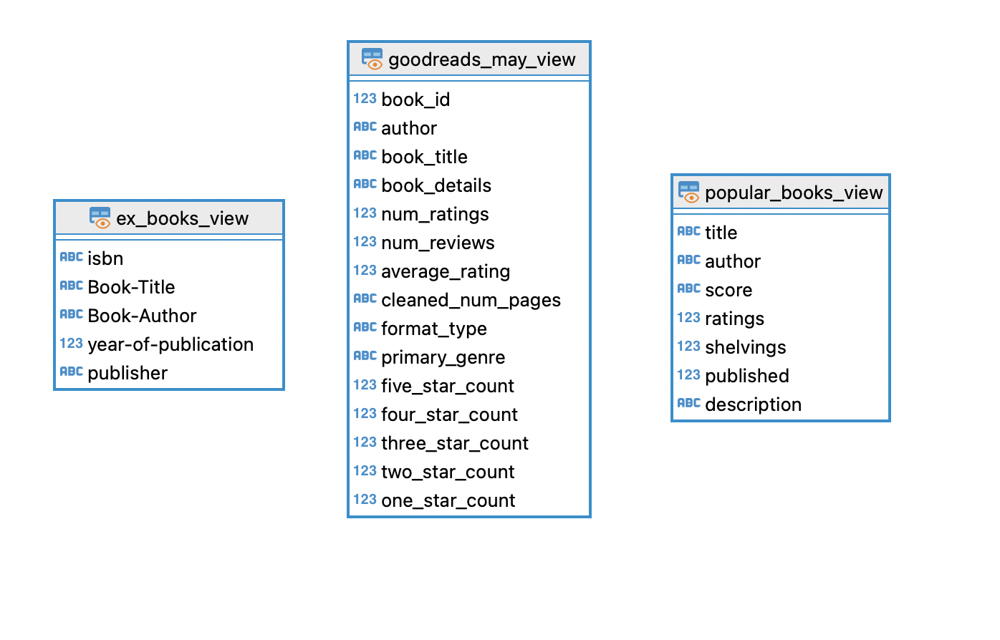

# Book Dataset Analysis with PostgreSQL

This project involves exploratory data analysis (EDA) on a dataset of books using PostgreSQL. The SQL scripts included in this repository perform various analyses to understand the structure and quality of the data, identify duplicates, and prepare the data for further analysis or modeling. As a data source I used three separate CSVs from Kaggle.

## Files

- **`data`**: contains the three CSV files, used for this project.
- **`sql-scripts`**: contains PostgreSQL queries for creating all tables and analysis on the dataset.

## Overview of EDA PostgreSQL Queries

The `exploratory-analysis.sql` file contains PostgreSQL queries such as:

**Checking for missing values**:

```sql
 SELECT COUNT(*) AS missing_num_reviews
 FROM goodreads_may gm
 WHERE num_reviews IS NULL;
```

**Counting Groups of Duplicates**:

```sql
 SELECT duplicate_count, COUNT(*) AS number_of_groups
 FROM (
	    SELECT COUNT(*) AS duplicate_count
	    FROM ex_books eb
	    GROUP BY isbn,"Book-Title", "Book-Author", "year-of-publication", publisher
	    HAVING COUNT(*) > 1
     ) AS subquery
 GROUP BY duplicate_count
 ORDER BY duplicate_count;
```

**Correlation between numeric columns**:

```sql
 SELECT
     corr(num_ratings, num_reviews) AS corr_num_ratings_reviews,
     corr(num_ratings, average_rating) AS corr_num_ratings_avg_rating,
     corr(num_reviews, average_rating) AS corr_num_reviews_avg_rating
 FROM goodreads_may gm ;
```

## Data Cleaning and View Creation in PostgreSQL

The project involved working with a dataset containing book-related information, where the raw data had several formatting inconsistencies that needed to be addressed. The goal was to clean this data, extract the necessary components, and create a SQL view that would make querying the dataset more efficient and insightful.

### Data Cleaning:

1. Numerical Data: Cleaned the num_pages column, which contained strings in the format ['652']. I have removed unnecessary characters like brackets and quotes to convert the data into a clean numerical format.
2. Textual Data: Extracted and cleaned the format and genres columns. For format, I handled entries like ['652 pages, Paperback'] to isolate the format_type (e.g., "Paperback"). Similarly, we extracted the primary genre from a list of genres.
3. Rating Distribution: Parsed and cleaned the rating_distribution column, which contained JSON-like structures (e.g., {'5': '2,892,322', '4': '970,190', ...}). I extracted individual star ratings and converted them to integer values for analysis.

### PostgreSQL View

After cleaning the data, I created a PostgreSQL view that provided easy access to the cleaned data. The view encapsulates the transformations, ensuring that users can query the data without needing to perform the cleaning steps repeatedly. Below is the diagram.



## Analysis

Since the three tables came from different sources, I used some advanced SQL methods to combine the data and run queries. This allowed me to answer general questions by carefully linking, filtering, and summarizing the information from each table. I made sure the queries were accurate and kept the data consistent so that the results were reliable and easy to understand.

## Findings

I then tried to find answers to the following questions based on the data analysis:

1. **Impact of Book Format and Genre on Ratings and Scores**

   - Based on my analysis, certain genres consistently perform better in specific formats. For example, Audiobooks tend to have higher average ratings in the Fantasy genre, while Hardcover editions excel in Science Fiction.
   - A broad diversity of genres across different formats, with some genres, such as Poetry and Nonfiction, maintaining strong average ratings across multiple formats. This indicates that while certain genres thrive in specific formats, others have widespread appeal across various formats.

2. **Author Success Analysis**
   - Certain authors consistently achieve high average ratings across multiple genres and formats. This suggests that these authors have a broad appeal a high standard of quality across different types of content.
   - authors who specialize in Science Fiction and Fantasy tend to perform well across formats like Hardcover and Paperback.

3. **Author Success Analysis**
    - Certain authors consistently received higher ratings and scores than the average within their respective genres, indicating strong performance and reader satisfaction
    - The analysis revealed that some genres tend to have higher average ratings and scores than others. This suggests that books in these genres are generally well-received by readers. 

